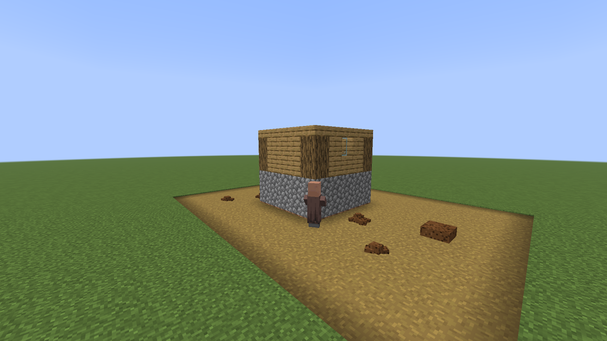
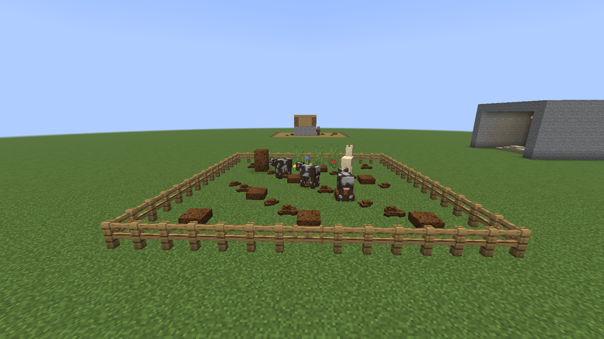
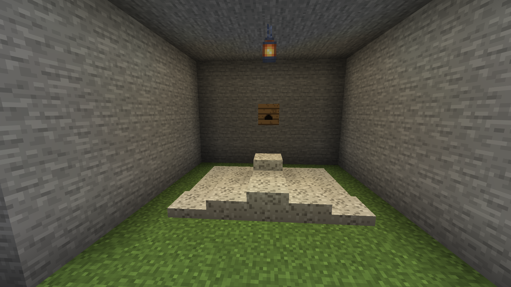

# Poopsmith

A Minecraft Fabric mod. Everything that eats, poops.

## Screenshots

## What This Mod Does

Animals drop layers on their own daily schedule, players carry a server-tracked digestive tract, villagers use the privy if the village built one, bats pay their way in guano, and the poop rots down into fertiliser. It is a nutrient cycle with a punchline, and the punchline is load-bearing: the reason to shovel the street is that the shovelling is worth something.

## Piles

A snow-layer-alike block (1-8 layers) that stacks as poop accumulates. The first two layers render as chunky piles rather than flat sheets, and a third packs them down into a sheet no taller. That is all a loose heap takes: a fourth deposit slides to one of the eight tiles around it instead, so a busy spot spreads into a wide field rather than growing a tower. Only once every tile it could roll to is at three does the patch climb, a layer at a time on whichever pile is lowest, so it thickens as a mat. Natural accumulation stops at the full 8 layers, and where the pile is held in, by walls on all four sides (a latrine pit, a fenced corner, a hole you dug) or a poop block underneath, the ninth deposit packs it into a poop block: nine poop to a block, the same nine it crafts from. Shovel is the right tool; mining drops one poop item per layer.

**Nothing you can trip over.** A pile has no collision at any depth, so a herd cannot wall itself into a corner of its own pen, and a path through a field stays a path.

**Bigger animals leave more, and sooner.** How much and how often comes from the space the animal takes up - width squared by height, vanilla's own reckoning, and the same test farmland already uses to decide who is heavy enough to trample it. A rabbit is 0.08 and waits twice as long as usual; a cow is 1.1 and sets the pace; a horse is 3.1 and comes round a little sooner; a camel is 6.9 and leaves two layers when it goes. No table of entity ids to maintain, so a modded moose sorts itself.

## Flies

A loose pile of one to three layers draws a few near-black specks zig-zagging over it in short darting legs, close up and during daylight hours only. Put any block on top, or stack it past three layers, and they stop. They are ordinary particles sent by the server, so vanilla clients see them too; guano attracts none, and caves stay quiet.

## Reading A Pile

With [block-tip](../block-tip) installed, a pile of one to three layers names what left it and how cold the trail has gone: `Cow, fresh, north`, then `warm`, then `soft`, then just `Old`. A hundred seconds a band, so a pile that still talks is a quarter of a day old at most. The kind only, never the individual. The heading is the way it was facing as it went and only the first two bands carry it: cold sign keeps its maker, not its direction. A pile two different animals have been at reads Old at any age. A stack taller than a loose heap says nothing at all: it is a heap somebody built, not a trail somebody left, so the piles that talk are exactly the wild ones out in the street and a latrine keeps its users anonymous. None of it is written to disk: a restart forgets every trail.

## Who Goes, And Where

Every animal poops at least once per Minecraft day, on its own randomly-seeded schedule (no dawn chorus), with a suitably undignified sound. Water animals (fish, squid, dolphins) do it too, in the water, as fish do: a brown cloud that disperses in the current instead of a layer, which also applies to anyone or anything pooping while swimming.

**Llamas.** llamas and trader llamas walk to the nearest existing poop pile within ~16 blocks and go there, founding a communal spot in place when none exists. A llama that can't reach the spot in time has an accident where it stands.

## Shovelling It

Shovel is the right tool. Mining a stack by hand forces the decay instead, so the growth still happens and the items do not.

**Pooper Scooper** is a shovel enchantment of three levels, ordinary enough to turn up in an enchanting table, on a villager's trades, or in loot. Each level finds one more poop or guano in a pile than was strictly in it, so a full stack under a level III shovel comes up three richer. Somebody has to want this job.

An animal standing in a crop when it goes leaves no pile: the crop gets a bonemeal's growth on the spot, and a big animal's double helping feeds the plants round it too, so a pen fenced over a field grows the field. Layers rot away on random ticks, a layer at a time, taking about half a Minecraft day each. A rotting layer feeds the ground below it - or the crops planted alongside, with the green particle burst - roughly one time in four. Breaking any poop or guano block without a shovel forces the decay instead of dropping anything: one growth charge per layer, nine for a full block.

**A pile that keeps being added to keeps living.** Decay is per layer, so every fresh deposit buys the heap another layer's worth of time. Somewhere a herd stands all day gains faster than it rots and needs shovelling; ground the animals only cross now and then clears itself. Room is the other answer to muck, and the cheaper one.

**A heap on a poop block does not rot at all.** A block underneath is not ground with muck on it, it is muck somebody packed - a pit they dug, a corner they fenced - and the layers riding on top are the same heap still being built. A midden keeps until it is shovelled. Guano never rotted in the first place.

**Muck on bare tilled ground sows it.** Bonemeal does nothing to farmland with nothing in it, so a layer rotting there, a pile broken there, or a handful thrown there plants instead: one crop, drawn from the ones growing within three blocks, counted rather than listed, so a wheat field mostly reseeds itself and a mixed garden comes up mixed. Nothing growing in reach means nothing to carry and the charge goes off as a puff - seed has to come from somewhere, and muck has been through something that ate a field.

## Off A Ledge

A poop dropped over an edge falls as far as there is world to fall through, with a descending
whistle for exactly as long as the fall and then the landing: a splat on ground, a sploosh into
water, a sizzle into lava. The splat's echo back up to you gets fainter the longer the drop,
because a hundred blocks down is barely audible, and that distance is the joke. A hundred-block
drop earns the **Off a Cliff** advancement.

## The Poop Item

The poop item throws like a snowball. Hitting a player inflicts brief nausea and slowness. Landing on the ground fertilises where it lands, one layer's worth, so a thrown handful is muck arriving all at once rather than only a prank.

**Poop block.** Nine poop items, three by three, craft a full block - the eight layers a heap stacks to and the one that caps it - which mines back into itself and crafts back into nine.

**Composting.** both the poop item (moderate chance) and poop block (high chance) feed the composter.

## The Digestive Tract

Food goes to the stomach, which is the vanilla hunger bar, and becomes waste as that drains: every hunger point spent adds 3 to a persistent 0-100 bar. Raw meat, rotten flesh, and suspicious foods add a hefty 25 on the spot, with a ~30% diarrhea risk. Diarrhea fills the bar rapidly for ~90 seconds under Hunger + Nausea, and persists through relogging. The bar renders as a digestive tract that takes over the vanilla hunger bar's exact rectangle and no more: a stomach at the left filling with amber as you eat, its outlet feeding a pink intestine that squiggles rightward and fills with brown as you don't poop, and a sphincter at the end that a poop icon briefly pops out of when you do. Clients whose Pandorical build can suppress vanilla HUD elements get it in place of the drumsticks; older ones keep the drumsticks and get the tract one row higher. Poop voluntarily with a keybind (default `G`, rebindable in the controls screen under the Pandorical category, bar >= 20) or involuntarily at 100. Either way: a layer at your feet, a fart, a hunger point, and a reset bar. Sneak while pooping to aim it one block behind you, dropping into whatever is down there, which is exactly how you use a latrine pit with dignity. Aimed at a crop it is manure instead: the plant gets a bonemeal's growth and no pile is ever left in the row (a crop grown out just wastes it), and a double deuce (bar at 80 or more) feeds the plants round it as well. Anywhere else a double deuce is two layers, and aimed behind you both go behind you. Also: your first ever step into the Nether carries a 50% chance of an immediate accident, rolled exactly once per player, regardless of how empty you thought you were.

The bar is per player and survives a relog. It does **not** survive a death: you come back empty, which is the one mercy in the whole system.

## Bed Accidents

Going to sleep on a nearly full intestine is a roll of the dice: nothing at 70 or under, ramping to about 1 in 3 just short of full. A full bar or the runs is no roll at all: it happens. It lands a couple of seconds into the sleep screen, close enough to hear, as a pile on the bed, sitting on the mattress, which a shovel takes off again. The bar empties and the hunger point is spent as if you had gone properly, and you wake to a quiet "Not again". The bed itself is left alone.

## Village Latrines

Villagers poop too: roughly once per day, never at night and never mid-sleep. Where they go depends on the plumbing:

- **The latrine**: a small privy hut whose floor opens onto a pit lined at the bottom with a poop block. It comes in one variant per village biome, built from the same materials vanilla's own houses use there (oak in plains, spruce in taiga, spruce over packed ice with a snow-capped roof in snowy, acacia in savanna, and sandstone with a slab roof and open windows in desert), so a village gets the privy that matches its houses. Naturally generated villages can include one (it joins the vanilla house pools) and get the deep four-block pit, dug out under the hut as the structure is placed; if [village-builder](../village-builder) is installed, growing villages can construct the variant matching their own biome as a utility building, with the shallower pit the template itself carries. The door sits flush with the street, no step: a villager with business to do walks to the nearest latrine within about 32 blocks, stands at the pit rim, and deposits into the pit.
- **The compost pit rule**: poop layers stacked on top of a poop block count as held in, so they keep climbing to the full 8 layers and the ninth deposit converts the stack into a new full poop block. This works anywhere, not just latrines, so any poop block you place becomes the seed of a slowly rising compost column: standing on one counts as contained, so the stack above it packs down into another block instead of stopping at eight. A latrine pit therefore fills itself into solid poop blocks over time; clean it out by mining (shovel), which is the harvest.
- **No latrine?** Villagers fall back to the communal street pile (the same one llamas use), or failing that, wherever they happen to be standing. Streets of a latrine-less village will show it.
- **Llama etiquette, amended**: llamas actively avoid latrine stacks and stick to street piles. The latrine is for villagers; the llama knows its place.
- **Latrine quests**: with [village-quests](../village-quests) installed, villagers hand out latrine work: shoveling a town whose streets have accumulated too many open-air piles, cleaning out a pit that has filled with converted poop blocks (mine and deliver the proof), and digging a village its first latrine, with the quest text teaching the seed-block mechanic outright. The dig reward includes spare seed blocks, so the practice spreads. Scooping a pile of poop or guano inside a village earns a little reputation too, at most once a minute. And mind where you go: a villager who watches you poop in the open remembers, and will bring it up. A covered pit keeps your business your own.
- **The poopsmith**: rarely, a nitwit is born to a higher calling. Nothing about the villager changes except that it is, quietly and permanently, a poopsmith, and on Pandorical clients it wears its orange work gloves with pride. Vanilla clients see a plain nitwit.

## The Guano Economy

Bats finally earn their keep. Every bat drops guano roughly once per day on its own schedule, and the guano falls from the roost: it lands as a pale grey layer on the first surface below, cave floors included. Guano layers stack like poop layers but never rot: a roost builds a bed of it where it falls, eight layers deep and then packed into guano blocks, open cave floor or not, for somebody to come and quarry. A shovel harvests one guano per layer, and breaking guano without one forces the growth out of it the way it does for poop.

- **Guano**: edible, barely nutritious, always eatable even on a full stomach. That last part matters because eating guano cures active diarrhea on the spot, clearing the Hunger and Nausea that come with it. It also tops the composter chart: one guano is one guaranteed compost level, richer than any poop. Nine guano craft a decorative guano block, and it crafts back into nine; it composts and burns just as well.
- **Bat box**: a wall-shelf-shaped box that generates guano without needing an actual bat nearby (the guano in the recipe is the lure). It only produces when it would make a decent roost: open sky above, at least 2 blocks of clearance below, and water within about 8 blocks. When happy it makes roughly 3 guano per day and stores up to 6; right-click with an empty hand to collect, and a comparator reads the fill level. Crafted from 7 planks around 1 wild guano, so the first one is always foraged. With [village-quests](../village-quests) installed, a farmer who trusts you (25 reputation) sells one for 8 emeralds and tells you where to hang it.
- **Gunpowder**: 1 guano + 1 charcoal + 1 sulfur makes 5 gunpowder. Charcoal specifically, coal will not do, and either ordinary or potent sulfur works. Saltpeter, charcoal and brimstone: the real recipe, and the guano is the saltpeter.
- **Dung fuel**: the whole family burns. Poop and poop layers smelt about 1.5 items each, guano and guano layers twice that, and the full blocks run a furnace for 9 of their item's worth. Nothing beats coal per item; the point is having somewhere useful to shovel it all.

## Pandorical

Poopsmith runs server-side, and Pandorical is a hard dependency: it carries every client-facing piece. Block, item and asset sync (the textures ship in this jar; Pandorical's virtual resource pack delivers them), the thrown-poop renderer, the digestive HUD including its takeover of vanilla's hunger bar, the poopsmith's gloves overlay, and the poop keybind, which is a pooled Pandorical keybind so no poopsmith jar ever reaches a client.

Clients are the optional half. A player on a Pandorical client gets the bar and the keybind; a player on a vanilla client participates fully server-side but cannot see the bar or go voluntarily. Accidents happen.

## Development

Installing and the map of the source are in [DEVELOPMENT.md](DEVELOPMENT.md).

## License

MIT, see [LICENSE](LICENSE).
